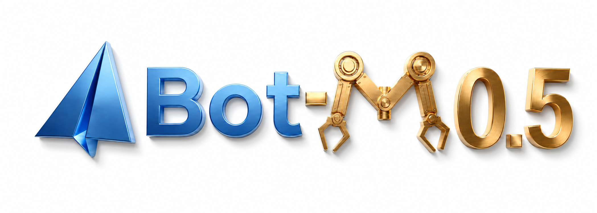
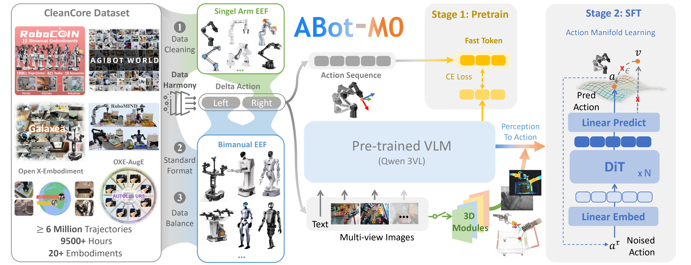

<div align="center">
<h2>🚀Note: ABot-M0.5 is coming soon! 🚀</h2>



<h1>ABot: VLA Foundation Models for Robotic Manipulation</h1>

<p align="center">
  <b>AMAP CV Lab</b>
</p>

<p align="center">
  <a href="https://arxiv.org/abs/2602.11236"></a>
  <a href="https://amap-cvlab.github.io/ABot-Manipulation/"></a>
  <a href="https://huggingface.co/acvlab"></a>
  <a href="https://www.modelscope.cn/datasets/amap_cvlab/Abot-M0-MetaData"></a>
</p>

</div>

---

## 📦 Repository Structure

This repository hosts the **ABot** family of vision-language-action (VLA) foundation models for robotic manipulation. Each version is maintained on a dedicated branch:

| Version | Branch | Status | Description |
| :--- | :--- | :--- | :--- |
| **ABot-M0** | [`ABot-M0`](https://github.com/amap-cvlab/ABot-Manipulation/tree/ABot-M0) | ✅ Released | VLA foundation model with Action Manifold Learning (AML) |
| **ABot-M0.5** | `ABot-M0.5` | 🚀 Coming Soon | Next-generation ABot model |

---

## 🌟 ABot-M0 Highlights

<div style="text-align: center;">
  
</div>

- **Massive & Unified Data:** Integrates over 6 million open-source trajectories — the largest unified dataset for robotic manipulation.

- **Innovative Action Paradigm:** Pioneers Action Manifold Learning (AML), which directly predicts clean actions instead of noise.

- **Modular 3D Perception:** Supports plug-and-play modules to enhance 3D spatial understanding.

### Results

|  | LIBERO | LIBERO-PLUS | RoboCasa-GR1-Tabletop | RoboTwin2.0 |
| :--- | :--- | :--- | :--- | :--- |
| **ABot-M0** | **98.6** | **80.5** | **58.3** | **86.1** |

---

## 🚀 Get Started with ABot-M0

Clone the repository and switch to the `ABot-M0` branch for installation, training, and evaluation:

```bash
git clone https://github.com/amap-cvlab/ABot-Manipulation.git
cd ABot-Manipulation
git checkout ABot-M0
```

See the [ABot-M0 README](https://github.com/amap-cvlab/ABot-Manipulation/blob/ABot-M0/README.md) for detailed setup instructions.

---

## 🏆 Model Zoo

| Model Name | Repository | Description |
| :--- | :--- | :--- |
| ABot-Pretrain | [🤗 ABot-M0-Pretrain](https://www.modelscope.cn/models/amap_cvlab/ABot-M0-Pretrain) | Pre-training with action manifold learning |
| ABot-LIBERO | [🤗 ABot-M0-LIBERO](https://huggingface.co/acvlab/ABot-M0-LIBERO) | Trained on LIBERO for LIBERO & LIBERO-Plus evaluation |
| ABot-RoboCasa-GR1-Tabletop | [🤗 ABot-M0-Robocasa](https://huggingface.co/acvlab/ABot-M0-Robocasa) | Trained on RoboCasa-GR1-Tabletop |
| ABot-Robotwin2 | [🤗 ABot-M0-RoboTwin2](https://huggingface.co/acvlab/ABot-M0-RoboTwin2) | Trained on RoboTwin2 Clean and Randomized |

---

## 📢 News

[2026-6-1] 🥳 **ABot-M0** is now integrated with [RLinf](https://github.com/RLinf/RLinf), supporting PPO training.

[2026-3-27] 🥳 **ABot-M0** [training code](https://github.com/amap-cvlab/ABot-Manipulation/tree/ABot-M0), [pre-trained weights](https://www.modelscope.cn/models/amap_cvlab/ABot-M0-Pretrain), and [data](https://www.modelscope.cn/datasets/amap_cvlab/Abot-M0-MetaData) are now available.

[2026-2-27] 🥳 **ABot-M0** [weights](https://huggingface.co/acvlab) and [inference code](https://github.com/amap-cvlab/ABot-Manipulation/tree/ABot-M0) released. RoboTwin2.0 result updated to 86.1.

[2026-2-11] 🥳 **ABot-M0** [technical report](https://arxiv.org/abs/2602.11236) released.

---

## 📜 Citing

If you find **ABot** useful in your research or applications, please consider giving us a **star** 🌟 and citing:

```
@article{yang2026abot,
  title={ABot-M0: VLA Foundation Model for Robotic Manipulation with Action Manifold Learning},
  author={Yang, Yandan and Zeng, Shuang and Lin, Tong and Chang, Xinyuan and Qi, Dekang and Xiao, Junjin and Liu, Haoyun and Chen, Ronghan and Chen, Yuzhi and Huo, Dongjie and others},
  journal={arXiv preprint arXiv:2602.11236},
  year={2026}
}
```

---

## 🙏 Acknowledgement

This project builds upon [starVLA](https://github.com/starVLA/starVLA), [Qwen3-VL](https://github.com/QwenLM/Qwen3-VL), [vggt](https://github.com/facebookresearch/vggt), [JiT](https://github.com/LTH14/JiT), [LeRobot](https://github.com/huggingface/lerobot), [Isaac-GR00T](https://github.com/NVIDIA/Isaac-GR00T) and [any4lerobot](https://github.com/Tavish9/any4lerobot). We thank these teams for their open-source contributions.
