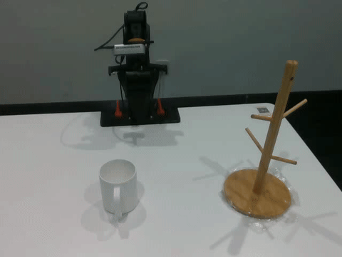
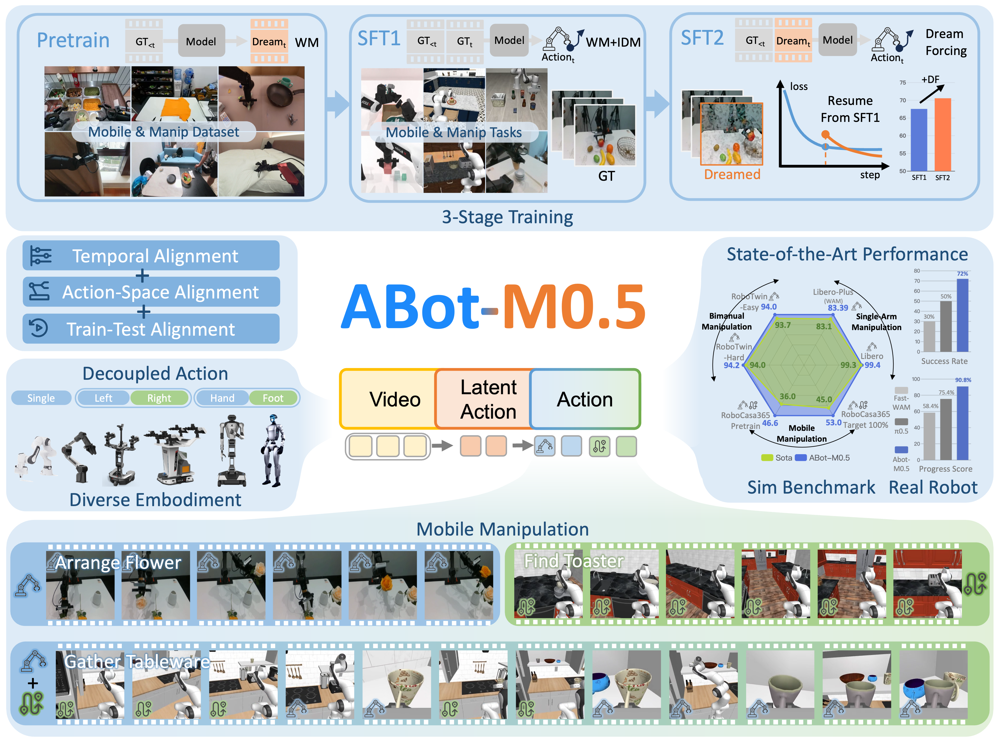
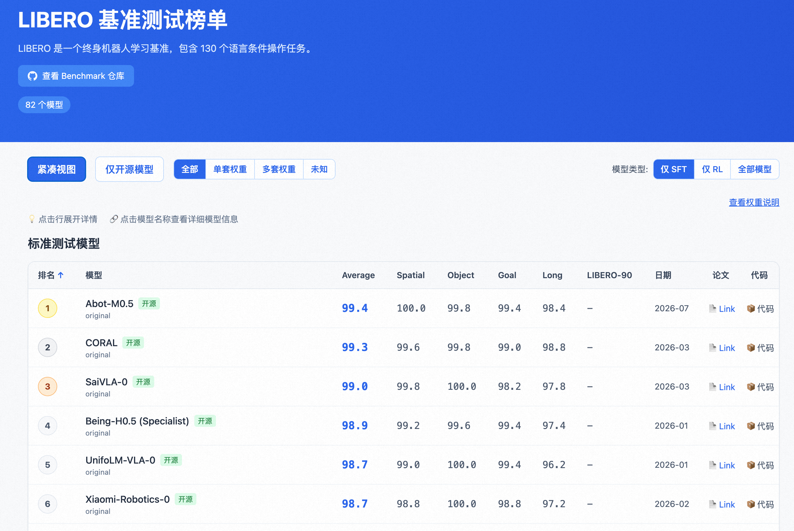
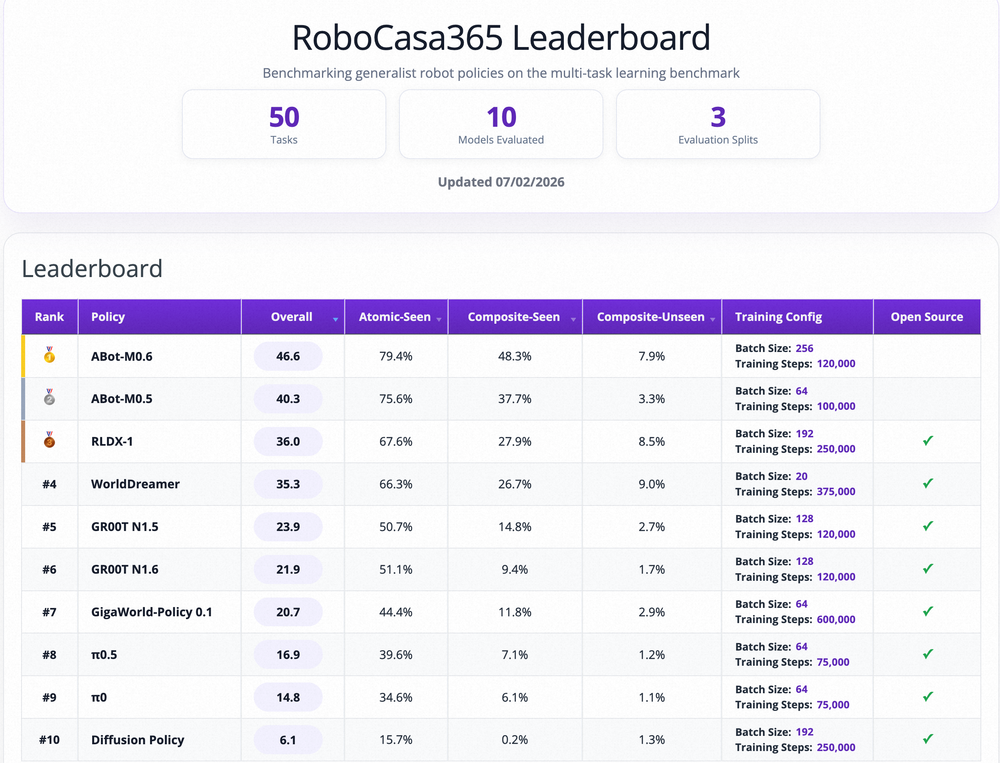

<div align="center">


<h1>ABot-M0.5: Unified Mobility-and-Manipulation World
Action Model</h1>

<p align="center">
  <b>AMAP CV Lab</b>
</p>

<p align="center">
  <a href="https://arxiv.org/pdf/2607.00678"></a>
  <a href="https://huggingface.co/acvlab"></a>
  <a href="#"></a>
</p>


</div>

<table align="center" width="100%">
  <tr>
    <td align="center" width="33%">
      
      <b>Arrange Flower</b>
    </td>
    <td align="center" width="33%">
      
      <b>Arrange Fruits</b>
    </td>
    <td align="center" width="33%">
      
      <b>Hang Cup</b>
    </td>
  </tr>
</table>

## 🌟 Core Highlights

<div style="text-align: center;">
  
</div>

Unlike reactive VLA policies or existing WAMs that suffer from structural mismatches, **ABot-M0.5** is built on the insight that mobile manipulation requires strict alignment at three levels. Our core innovations include:

- 🎯 **Three-Level Alignment Paradigm:** We systematically identify and solve the structural bottlenecks in mobile manipulation: temporal granularity mismatch, action space entanglement, and train-test inconsistency.
- 🎬 **Temporal Granularity Alignment (Latent Actions):** We introduce frame-level latent actions as a bridging space between coarse video latents and fine-grained robot controls, effectively capturing local visual state transitions and contact dynamics.
- 🤖 **Action Space Alignment (Dual-level MoT):** We design an Action-Decoupled Mixture-of-Transformers architecture that separates heterogeneous action subspaces (e.g., base movement and arm manipulation), preventing action-distribution conflicts.
- 🧠 **Inference Consistency Alignment (Dream-Forcing):** We propose a novel training strategy that progressively trains inverse dynamics on model-predicted (dreamed) videos, perfectly aligning training conditions with autoregressive inference and eliminating error accumulation.
- 🏆 **State-of-the-Art Performance:** ABot-M0.5 achieves SOTA results across challenging benchmarks (RoboCasa365, RoboTwin 2.0, LIBERO-Plus) and demonstrates robust zero-shot generalization in real-world long-horizon mobile manipulation tasks.

---

## Results 🎉🎉
|  | LIBERO | LIBERO-PLUS | RoboCasa365 | RoboTwin2.0 |
| :--- | :--- | :--- | :--- | :--- |
| Previous SOTA | 99.3 | 83.1 (WAM) | 36.0 | 94.0 |
| **ABot-M0.5** | **99.4** | **83.4** | **46.6** | **94.1** |
<div align="center">
  
  
  
</div>


## 📢 News

[2026-07-21] 🎉🎉 **Code Release.** The inference code, pre-trained weights, and evaluation scripts for **ABot-M0.5** are now available. 🎉🎉

[2026-07-01] 🥳🥳**ABot-M0.5**'s [technical report](https://arxiv.org/pdf/2607.00678) have been released. Weights and codes are coming soon. 🎉🎉

[2026-6-1] 🥳🥳**ABot-M0** is now integrated with [RLinf](https://github.com/RLinf/RLinf), supporting PPO training. 🎉🎉

[2026-3-27] 🥳🥳**ABot-M0**'s 🎉🎉 [training code](https://github.com/amap-cvlab/ABot-Manipulation/tree/ABot-M0), [pre-trained weight](https://www.modelscope.cn/models/amap_cvlab/ABot-M0-Pretrain) and [data](https://www.modelscope.cn/datasets/amap_cvlab/Abot-M0-MetaData) are now available.🎉🎉

[2026-2-27] 🥳🥳**ABot-M0**'s The [weights](https://huggingface.co/acvlab) and [inference code](https://github.com/amap-cvlab/ABot-Manipulation/tree/ABot-M0) have been released. And updated the latest result of ABot-M0 on RoboTwin2.0 to 86.1. The full content will be released soon.🎉🎉

[2026-2-11] 🥳🥳**ABot-M0**'s [technical report](https://arxiv.org/abs/2602.11236) have been released. Weights and codes are coming soon. 🎉🎉

---

## 🚀 Quick Start of ABot-M0.5

For installation, checkpoint download, and evaluation instructions for LIBERO and RoboCasa365 benchmarks, please refer to **[GETTING_STARTED.md](GETTING_STARTED.md)**.

## 📜 Citing

If you find **ABot-M0.5** and  **ABot-M0**  is useful in your research or applications, please consider giving us a **star** 🌟 and **citing** it by the following BibTeX entry:

```
@article{chen2026abotm05,
  title={ABot-M0.5: Unified Mobility-and-Manipulation World Action Model},
  author={Chen, Ronghan and Yang, Yandan and Tang, Zuojin and Huo, Dongjie and Lin, Tong and Wu, Haoning and Liu, Haoyun and Chen, Yuzhi and Zheng, Lulu and Yuan, Botai and Li, Tianlun and Wang, Mingxin and Qi, Dekang and Hu, Bin and Mei, Wei and Xuan, Yuze and Yang, Haolong and Zhu, Yanqing and Xu, Mu and Ma, Zhiheng and Chang, Xinyuan},
  journal={arXiv preprint arXiv:2607.00678},
  year={2026}
}

@article{yang2026abot,
  title={ABot-M0: VLA Foundation Model for Robotic Manipulation with Action Manifold Learning},
  author={Yang, Yandan and Zeng, Shuang and Lin, Tong and Chang, Xinyuan and Qi, Dekang and Xiao, Junjin and Liu, Haoyun and Chen, Ronghan and Chen, Yuzhi and Huo, Dongjie and others},
  journal={arXiv preprint arXiv:2602.11236},
  year={2026}
}
```

